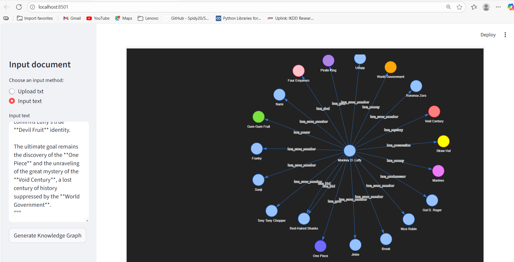

# Knowledge Graph Generator

A Streamlit application that extract graph data (entities and relationships) from text input using LangChain and OpenAI's GPT models or Groq models, and generates interactive graphs.



## Features

- Two input methods: text upload (.txt files) or direct text input
- Interactive knowledge graph visualization
- Customizable graph display with physics-based layout
- Entity relationship extraction powered by OpenAI's GPT-4o model or Groq llama model

## Installation

### Prerequisites

- Python 3.8 or higher
- OpenAI API key or Groq API key

### Dependencies

The application requires the following Python packages:

- langchain : Core LLM framework
- langchain-experimental : Experimental LangChain features
- langchain-openai : OpenAI integration for LangChain OR
- langchain-groq : Groq integration for Langchain
- python-dotenv : Environment variable support
- pyvis : Graph visualization
- streamlit : Web UI framework


### Setup

1. Clone this repository:
   ```bash
   git clone [repository-url]
   cd TextSpider-knowledge-graph-weaver
   ```

   Note: Replace `[repository-url]` with the actual URL of this repository.

2. Create a `.env` file in the root directory with your OpenAI API key:
   ```
   OPENAI_API_KEY=your_openai_api_key_here
   GROQ_API_KEY=your_openai_api_key_here
   ```

3. Install all required dependencies using the provided pyproject.toml file:

```bash
pip install uv
uv sync
```

## Running the Application

To run the Streamlit app:

```bash
streamlit run app.py
```

This will start the application and open it in your default web browser (typically at http://localhost:8501).

## Usage

1. Choose your input method from the sidebar (Upload txt or Input text)
2. If uploading a file, select a .txt file from your computer
3. If using direct input, type or paste your text into the text area
4. Click the "Generate Knowledge Graph" button
5. Wait for the graph to be generated (this may take a few moments depending on the length of the text)
6. Explore the interactive knowledge graph:
   - Drag nodes to rearrange the graph
   - Hover over nodes and edges to see additional information
   - Zoom in/out using the mouse wheel
   - Filter the graph for specific nodes and edges.

## How It Works

The application uses LangChain's experimental graph transformers with OpenAI's GPT-4o model to:
1. Extract entities from the input text
2. Identify relationships between these entities
3. Generate a graph structure representing this information
4. Visualize the graph using PyVis, a Python interface for the vis.js visualization library